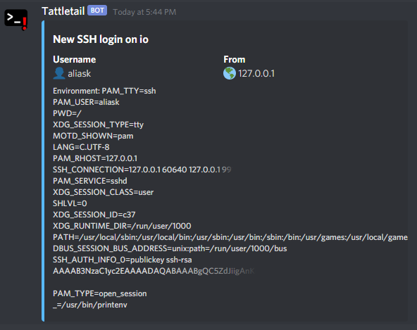

# SSH Tattletail

Tiny shell script that sends a Discord notification when a SSH login occurs.

## Requirements

- SSH Daemon using Pluggable Authentication Module (PAM)
- Curl
- Awk
- Discord Webhook URL

## Installation

A super-easy guided installer is provided:

```
$ sudo ./install.sh
Enter your Discord Webhook URL (https://discord.com/api/webhooks/...):
https://discord.com/api/webhooks/000000000000000000/000000000000000000000000000000000000000000000000000000000000000000-
🍉 Installing SSH tattletale...
🎉 Done! Test it out by doing a quick 'ssh localhost'!
```

## Example

